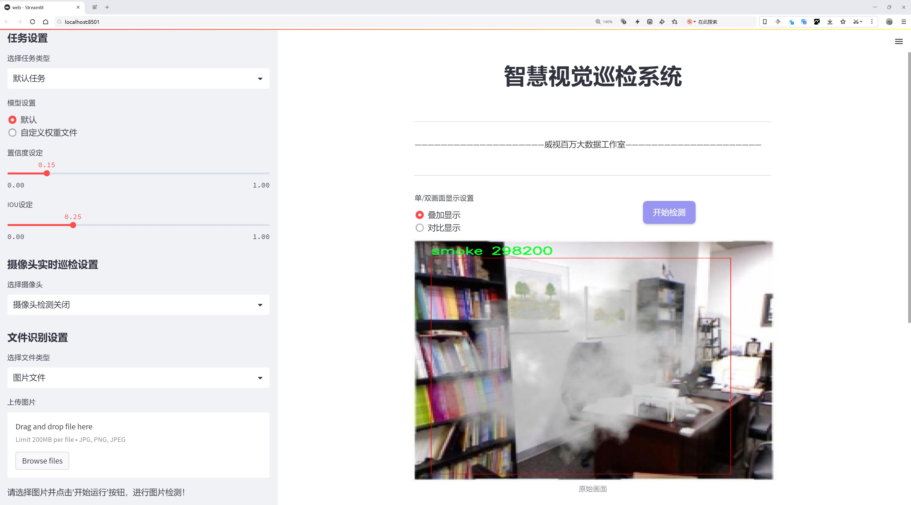
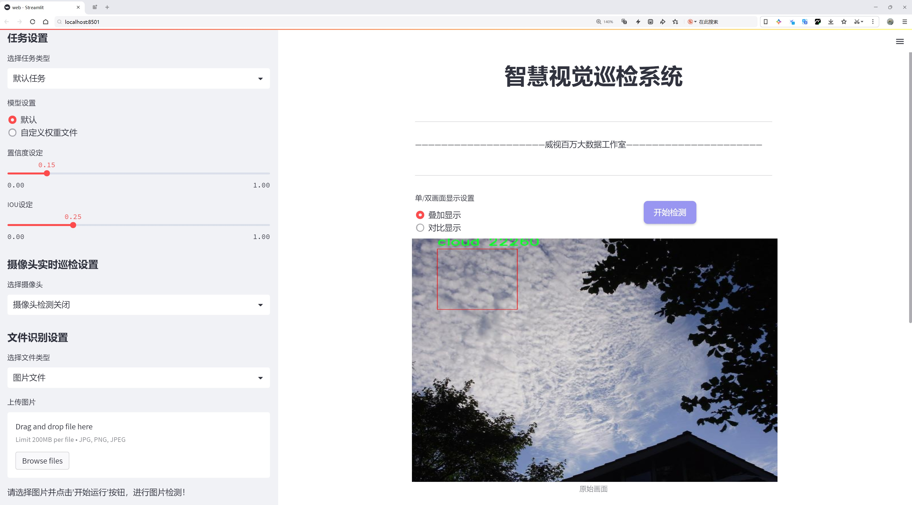
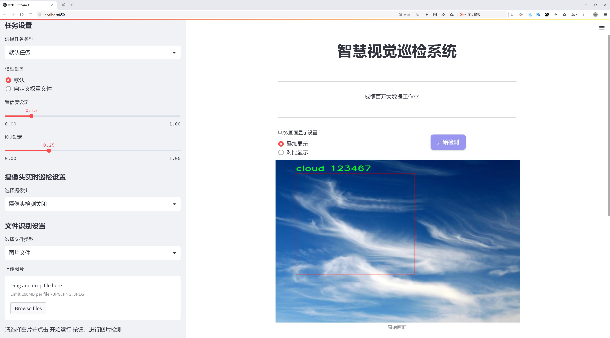
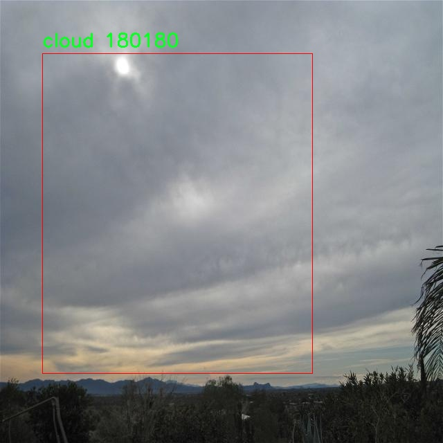
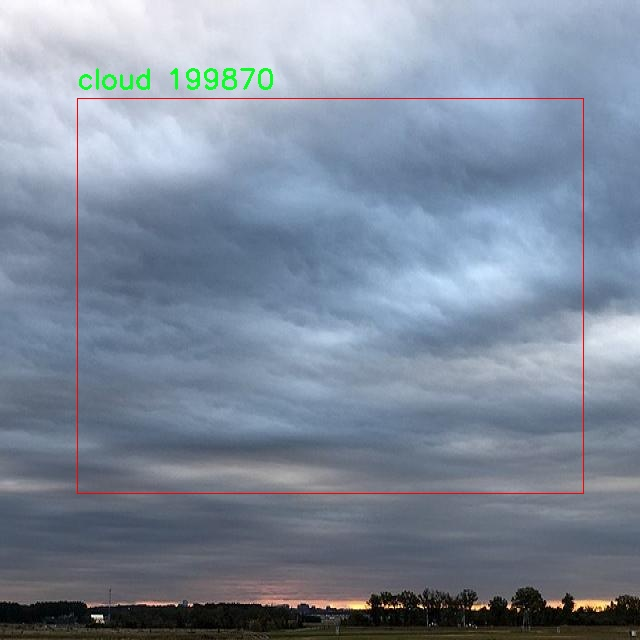
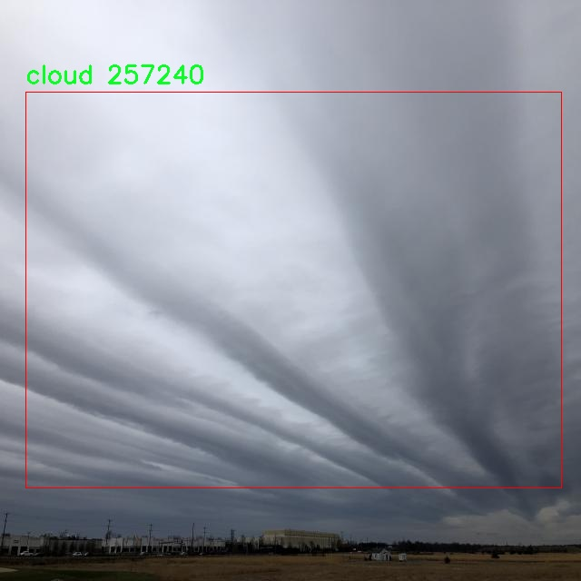
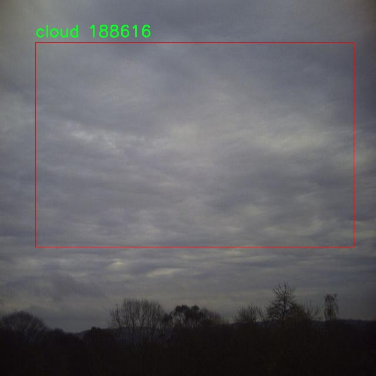
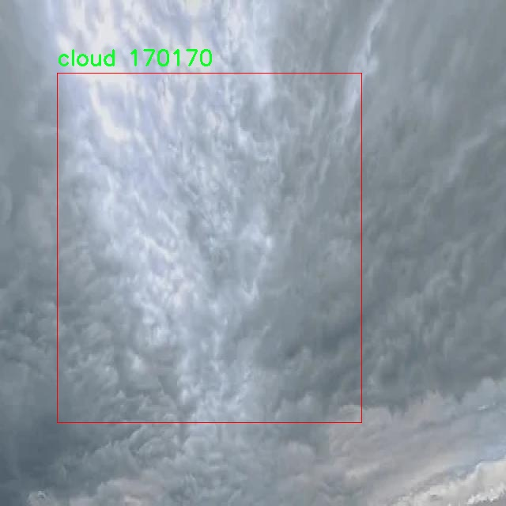

# 烟雾污染云层检测检测系统源码分享
 # [一条龙教学YOLOV8标注好的数据集一键训练_70+全套改进创新点发刊_Web前端展示]

### 1.研究背景与意义

项目参考[AAAI Association for the Advancement of Artificial Intelligence](https://gitee.com/qunmasj/projects)

项目来源[AACV Association for the Advancement of Computer Vision](https://kdocs.cn/l/cszuIiCKVNis)

研究背景与意义

随着全球工业化进程的加快和城市化水平的提升，烟雾污染已成为影响空气质量和人类健康的重要因素之一。烟雾不仅对生态环境造成了严重威胁，还引发了一系列健康问题，如呼吸道疾病、心血管疾病等。因此，及时、准确地监测烟雾污染的程度及其对云层的影响，对于制定有效的环境保护政策和公共健康策略具有重要意义。近年来，计算机视觉技术的迅猛发展为烟雾污染的监测提供了新的解决方案，尤其是基于深度学习的目标检测算法，如YOLO（You Only Look Once）系列，因其高效性和准确性而备受关注。

YOLOv8作为YOLO系列的最新版本，具备了更强的特征提取能力和更快的推理速度。然而，针对烟雾污染云层的检测，现有的YOLOv8模型在特定场景下的表现仍然存在一定的局限性。为了提升模型在烟雾和云层识别方面的准确性和鲁棒性，本文提出了一种基于改进YOLOv8的烟雾污染云层检测系统。该系统旨在通过优化模型结构和训练策略，提高对烟雾和云层的检测能力，从而实现对烟雾污染的实时监测。

本研究所使用的数据集包含3200幅图像，涵盖了烟雾和云层两大类，具备较高的多样性和代表性。这一数据集的构建不仅为模型的训练提供了丰富的样本，还为后续的模型评估和验证奠定了基础。通过对烟雾和云层的准确分类，研究将有助于深入理解烟雾污染对云层形成和气候变化的影响。此外，利用改进后的YOLOv8模型进行烟雾检测，可以实现对烟雾污染源的快速定位和追踪，为环境监测和治理提供数据支持。

在环境科学、气象学及公共健康等多个领域，烟雾污染的监测与分析都具有重要的应用价值。通过本研究的开展，期望能够为相关领域的研究者提供一种高效的工具，帮助他们更好地理解烟雾污染的动态变化及其对环境的影响。同时，研究成果也可为政府部门在制定环境保护政策时提供科学依据，推动社会对烟雾污染问题的重视与解决。

综上所述，基于改进YOLOv8的烟雾污染云层检测系统的研究，不仅在技术上具有创新性和实用性，也在社会、经济和环境层面上具有重要的现实意义。通过本研究的实施，期望能够为烟雾污染的监测和治理提供新的思路和方法，为实现可持续发展目标贡献力量。

### 2.图片演示







##### 注意：由于此博客编辑较早，上面“2.图片演示”和“3.视频演示”展示的系统图片或者视频可能为老版本，新版本在老版本的基础上升级如下：（实际效果以升级的新版本为准）

  （1）适配了YOLOV8的“目标检测”模型和“实例分割”模型，通过加载相应的权重（.pt）文件即可自适应加载模型。

  （2）支持“图片识别”、“视频识别”、“摄像头实时识别”三种识别模式。

  （3）支持“图片识别”、“视频识别”、“摄像头实时识别”三种识别结果保存导出，解决手动导出（容易卡顿出现爆内存）存在的问题，识别完自动保存结果并导出到tempDir中。

  （4）支持Web前端系统中的标题、背景图等自定义修改，后面提供修改教程。

  另外本项目提供训练的数据集和训练教程,暂不提供权重文件（best.pt）,需要您按照教程进行训练后实现图片演示和Web前端界面演示的效果。

### 3.视频演示

[3.1 视频演示](https://www.bilibili.com/video/BV1ZgxTezESw/)

### 4.数据集信息展示

##### 4.1 本项目数据集详细数据（类别数＆类别名）

nc: 2
names: ['cloud', 'smoke']


##### 4.2 本项目数据集信息介绍

数据集信息展示

在本研究中，我们采用了名为“yolov10_smoke2”的数据集，以训练和改进YOLOv8模型，旨在提升烟雾污染云层的检测能力。该数据集专门针对烟雾和云层的识别任务，具有较高的应用价值，尤其是在环境监测和气象预报等领域。数据集的设计充分考虑了现实世界中烟雾和云层的多样性，确保模型在各种条件下的鲁棒性和准确性。

“yolov10_smoke2”数据集包含两个主要类别，分别为“cloud”（云层）和“smoke”（烟雾）。这两个类别的选择不仅反映了研究的重点，也体现了对环境污染问题的关注。云层的存在与烟雾的分布密切相关，因此，准确区分这两者对于理解和预测空气质量变化至关重要。数据集中包含的图像样本涵盖了不同天气条件、时间段和地理位置的场景，确保了数据的多样性和代表性。

在数据集的构建过程中，研究团队对图像进行了精心挑选和标注，确保每一张图像都能清晰地展示出云层和烟雾的特征。标注工作采用了专业的图像标注工具，确保了标注的准确性和一致性。每个类别的样本数量经过合理分配，以避免类别不平衡对模型训练造成的影响。这种精细化的标注和样本选择策略，使得“yolov10_smoke2”数据集成为一个高质量的训练资源。

此外，数据集还考虑到了不同光照条件和视角对烟雾和云层检测的影响。研究中包含了晴天、阴天、雾霾等多种天气情况的图像，旨在提高模型在复杂环境下的适应能力。通过这种方式，模型不仅能够在理想条件下进行有效的检测，也能在实际应用中表现出色。

在训练过程中，我们将“yolov10_smoke2”数据集与YOLOv8模型相结合，利用其强大的特征提取能力和实时检测性能，进行深度学习训练。通过对模型的反复训练和调优，我们期望能够显著提高烟雾和云层的检测精度，进而为环境监测提供更为可靠的数据支持。

综上所述，“yolov10_smoke2”数据集不仅为本研究提供了丰富的训练素材，也为后续的模型优化奠定了坚实的基础。通过对烟雾和云层的深入分析，我们希望能够为解决日益严重的空气污染问题贡献一份力量，推动环境科学研究的进一步发展。











### 5.全套项目环境部署视频教程（零基础手把手教学）

[5.1 环境部署教程链接（零基础手把手教学）](https://www.ixigua.com/7404473917358506534?logTag=c807d0cbc21c0ef59de5)


[5.2 安装Python虚拟环境创建和依赖库安装视频教程链接（零基础手把手教学）](https://www.ixigua.com/7404474678003106304?logTag=1f1041108cd1f708b01a)

### 6.手把手YOLOV8训练视频教程（零基础小白有手就能学会）

[6.1 手把手YOLOV8训练视频教程（零基础小白有手就能学会）](https://www.ixigua.com/7404477157818401292?logTag=d31a2dfd1983c9668658)

### 7.70+种全套YOLOV8创新点代码加载调参视频教程（一键加载写好的改进模型的配置文件）

[7.1 70+种全套YOLOV8创新点代码加载调参视频教程（一键加载写好的改进模型的配置文件）](https://www.ixigua.com/7404478314661806627?logTag=29066f8288e3f4eea3a4)

### 8.70+种全套YOLOV8创新点原理讲解（非科班也可以轻松写刊发刊，V10版本正在科研待更新）

由于篇幅限制，每个创新点的具体原理讲解就不一一展开，具体见下列网址中的创新点对应子项目的技术原理博客网址【Blog】：


[8.1 70+种全套YOLOV8创新点原理讲解链接](https://gitee.com/qunmasj/good)

### 9.系统功能展示（检测对象为举例，实际内容以本项目数据集为准）

图9.1.系统支持检测结果表格显示

  图9.2.系统支持置信度和IOU阈值手动调节

  图9.3.系统支持自定义加载权重文件best.pt(需要你通过步骤5中训练获得)

  图9.4.系统支持摄像头实时识别

  图9.5.系统支持图片识别

  图9.6.系统支持视频识别

  图9.7.系统支持识别结果文件自动保存

  图9.8.系统支持Excel导出检测结果数据


### 10.原始YOLOV8算法原理

原始YOLOv8算法原理

YOLOv8作为YOLO系列的最新成员，代表了目标检测领域的一次重要进步。相较于其前身YOLOv5，YOLOv8在检测精度和速度上都取得了显著的提升。这一进步得益于其创新的网络结构设计和优化的训练策略，使得YOLOv8能够在各种应用场景中展现出更强的适应性和性能。

YOLOv8的网络结构主要由四个部分组成：输入端、骨干网络、颈部网络和头部网络。输入端负责对输入图像进行预处理，包括马赛克数据增强、自适应锚框计算和自适应灰度填充等。这些预处理步骤不仅能够有效提升模型的鲁棒性，还能在一定程度上缓解过拟合问题。通过马赛克数据增强，YOLOv8能够在训练过程中生成多样化的样本，从而增强模型对不同场景的适应能力。

在骨干网络部分，YOLOv8采用了C2f和SPPF（Spatial Pyramid Pooling Fusion）结构。C2f模块是YOLOv8的核心组件之一，其设计灵感来源于YOLOv7的ELAN结构。C2f模块通过引入更多的分支和跨层连接，显著增强了模型的梯度流，使得特征学习更加高效。这种结构不仅提升了特征表示能力，还在一定程度上减轻了梯度消失的问题。SPPF模块则通过空间金字塔池化的方式，进一步提升了模型的计算速度，使得YOLOv8在实时检测任务中表现出色。

颈部网络采用了路径聚合网络（PAN）结构，这一设计旨在加强不同尺度特征的融合能力。通过对特征图进行上采样和下采样，PAN能够有效整合来自不同层次的特征信息，从而提高模型对多尺度目标的检测能力。这一特性在处理复杂场景时尤为重要，因为不同大小的目标往往需要不同的特征来进行有效的识别和定位。

头部网络则是YOLOv8的一大创新之处。与以往的耦合头结构不同，YOLOv8采用了解耦头结构，将分类和检测过程分开进行。这一设计不仅简化了模型的训练过程，还提高了分类和回归的精度。在损失计算方面，YOLOv8引入了Task-Aligned Assigner策略，通过对分类和回归分数的加权，优化了正负样本的匹配过程。这种方法有效提升了模型在训练过程中的收敛速度和最终的检测性能。

在损失函数的选择上，YOLOv8同样进行了重要的改进。分类分支采用了二元交叉熵损失（Binary Cross-Entropy Loss），而回归分支则结合了分布焦点损失（Distribution Focal Loss）和完全交并比损失（Complete Intersection over Union Loss）。这种组合不仅提升了模型对边界框预测的准确性，还增强了模型在复杂场景下的泛化能力。

YOLOv8的设计还考虑到了不同应用场景的需求，提供了多种模型版本，包括YOLOv8n、YOLOv8s、YOLOv8m、YOLOv8l和YOLOv8x。这些版本在参数量和检测速度上各有侧重，使得用户可以根据具体需求选择合适的模型。例如，YOLOv8n作为参数量最小且检测速度最快的版本，适合对实时性要求较高的应用场景，而YOLOv8x则在检测精度上表现更为出色，适合对精度要求极高的任务。

尽管YOLOv8在许多方面都取得了突破，但在复杂环境下，尤其是水面等背景多样的场景中，仍然存在一些挑战。例如，小目标的检测能力可能受到限制，导致定位误差和目标感知能力不足。为了解决这些问题，后续研究者们提出了针对YOLOv8的改进方案，如引入BiFormer双层路由注意力机制以增强特征提取过程中的上下文信息，或在Neck端引入GSConv和Slim-neck技术以保持精度并降低计算量。

总的来说，YOLOv8在目标检测领域的创新设计和高效算法，使其成为当前最先进的检测模型之一。通过不断优化网络结构和训练策略，YOLOv8不仅提升了检测精度和速度，还为实际应用提供了更为灵活的选择，推动了目标检测技术的进一步发展。随着研究的深入，YOLOv8及其衍生版本有望在更多复杂场景中展现出更强的性能，为智能视觉系统的应用奠定坚实的基础。


### 11.项目核心源码讲解（再也不用担心看不懂代码逻辑）

#### 11.1 ui.py

以下是经过简化和注释的核心代码部分：

```python
import sys
import subprocess
from QtFusion.path import abs_path

def run_script(script_path):
    """
    使用当前 Python 环境运行指定的脚本。

    Args:
        script_path (str): 要运行的脚本路径
    """
    # 获取当前 Python 解释器的路径
    python_path = sys.executable

    # 构建运行命令，使用 streamlit 运行指定的脚本
    command = f'"{python_path}" -m streamlit run "{script_path}"'

    # 执行命令并等待其完成
    result = subprocess.run(command, shell=True)
    
    # 检查命令执行的返回码，非零表示出错
    if result.returncode != 0:
        print("脚本运行出错。")

# 主程序入口
if __name__ == "__main__":
    # 获取脚本的绝对路径
    script_path = abs_path("web.py")

    # 运行指定的脚本
    run_script(script_path)
```

### 代码注释说明：

1. **导入模块**：
   - `sys`：用于访问与 Python 解释器相关的变量和函数。
   - `subprocess`：用于执行外部命令。
   - `abs_path`：从 `QtFusion.path` 导入的函数，用于获取文件的绝对路径。

2. **run_script 函数**：
   - 接受一个参数 `script_path`，表示要运行的 Python 脚本的路径。
   - 使用 `sys.executable` 获取当前 Python 解释器的路径，以确保使用相同的环境运行脚本。
   - 构建命令字符串，使用 `streamlit` 运行指定的脚本。
   - 使用 `subprocess.run` 执行命令，并等待其完成。
   - 检查返回码，如果不为零，表示脚本运行出错，打印错误信息。

3. **主程序入口**：
   - 在脚本作为主程序运行时，获取 `web.py` 的绝对路径。
   - 调用 `run_script` 函数来执行该脚本。

这个文件名为 `ui.py`，其主要功能是运行一个指定的 Python 脚本，具体是使用 Streamlit 框架来启动一个 Web 应用。文件中首先导入了必要的模块，包括 `sys`、`os` 和 `subprocess`，这些模块提供了与系统交互和执行外部命令的功能。此外，还从 `QtFusion.path` 模块中导入了 `abs_path` 函数，用于获取文件的绝对路径。

在 `run_script` 函数中，首先定义了一个参数 `script_path`，它是要运行的脚本的路径。函数内部首先获取当前 Python 解释器的路径，这样可以确保使用正确的 Python 环境来执行脚本。接着，构建了一个命令字符串，使用 `streamlit run` 命令来运行指定的脚本。这里使用了 `subprocess.run` 方法来执行这个命令，并通过 `shell=True` 参数允许在 shell 中执行命令。

在执行命令后，函数检查返回的结果码。如果返回码不为零，表示脚本运行过程中出现了错误，程序会打印出“脚本运行出错”的提示信息。

在文件的最后部分，使用 `if __name__ == "__main__":` 语句来确保当这个文件作为主程序运行时，以下代码才会被执行。这里指定了要运行的脚本路径为 `web.py`，并调用 `abs_path` 函数获取其绝对路径。最后，调用 `run_script` 函数来执行这个脚本。

总体来说，这个程序的目的是提供一个简单的接口，通过命令行启动一个 Streamlit Web 应用，方便用户在当前 Python 环境中运行指定的脚本。

#### 11.2 70+种YOLOv8算法改进源码大全和调试加载训练教程（非必要）\ultralytics\nn\autobackend.py

以下是代码中最核心的部分，并附上详细的中文注释：

```python
class AutoBackend(nn.Module):
    """
    处理Ultralytics YOLO模型的动态后端选择，用于推理。
    该类为各种推理引擎提供了一个抽象层，支持多种格式的模型。
    """

    @torch.no_grad()
    def __init__(self,
                 weights='yolov8n.pt',
                 device=torch.device('cpu'),
                 dnn=False,
                 data=None,
                 fp16=False,
                 fuse=True,
                 verbose=True):
        """
        初始化AutoBackend以进行推理。

        参数:
            weights (str): 模型权重文件的路径，默认为'yolov8n.pt'。
            device (torch.device): 运行模型的设备，默认为CPU。
            dnn (bool): 是否使用OpenCV DNN模块进行ONNX推理，默认为False。
            data (str | Path | optional): 额外的data.yaml文件路径，包含类名，默认为None。
            fp16 (bool): 是否启用半精度推理，仅在特定后端支持，默认为False。
            fuse (bool): 是否融合Conv2D和BatchNorm层以优化，默认为True。
            verbose (bool): 是否启用详细日志，默认为True。
        """
        super().__init__()
        # 处理权重文件路径
        w = str(weights[0] if isinstance(weights, list) else weights)
        # 确定模型类型
        pt, jit, onnx, xml, engine, coreml, saved_model, pb, tflite, edgetpu, tfjs, paddle, ncnn, triton = \
            self._model_type(w)

        # 处理设备和CUDA
        cuda = torch.cuda.is_available() and device.type != 'cpu'  # 检查CUDA可用性
        if cuda and not any([nn_module, pt, jit, engine]):  # 如果不支持的格式，强制使用CPU
            device = torch.device('cpu')
            cuda = False

        # 如果模型不在本地，则尝试下载
        if not (pt or triton or nn_module):
            w = attempt_download_asset(w)

        # 加载模型
        if nn_module:  # 如果是内存中的PyTorch模型
            model = weights.to(device)
            model = model.fuse(verbose=verbose) if fuse else model
            self.model = model  # 显式分配模型
        elif pt:  # PyTorch模型
            from ultralytics.nn.tasks import attempt_load_weights
            model = attempt_load_weights(weights if isinstance(weights, list) else w,
                                         device=device,
                                         inplace=True,
                                         fuse=fuse)
            self.model = model  # 显式分配模型
        elif jit:  # TorchScript模型
            model = torch.jit.load(w, map_location=device)
        elif dnn:  # ONNX OpenCV DNN
            net = cv2.dnn.readNetFromONNX(w)
        elif onnx:  # ONNX Runtime
            import onnxruntime
            session = onnxruntime.InferenceSession(w)
        # 其他模型格式的加载略...

        # 加载外部元数据YAML
        if isinstance(metadata, (str, Path)) and Path(metadata).exists():
            metadata = yaml_load(metadata)

        # 检查类名
        if 'names' not in locals():  # 如果类名缺失
            names = self._apply_default_class_names(data)
        names = check_class_names(names)  # 检查类名有效性

        # 禁用梯度
        if pt:
            for p in model.parameters():
                p.requires_grad = False

        self.__dict__.update(locals())  # 将所有局部变量分配给self

    def forward(self, im, augment=False, visualize=False):
        """
        在YOLOv8 MultiBackend模型上运行推理。

        参数:
            im (torch.Tensor): 要进行推理的图像张量。
            augment (bool): 是否在推理过程中进行数据增强，默认为False。
            visualize (bool): 是否可视化输出预测，默认为False。

        返回:
            (tuple): 包含原始输出张量和处理后的输出（如果visualize=True）。
        """
        b, ch, h, w = im.shape  # 获取输入图像的形状
        if self.fp16 and im.dtype != torch.float16:
            im = im.half()  # 转换为FP16
        if self.nhwc:
            im = im.permute(0, 2, 3, 1)  # 转换形状

        # 根据模型类型进行推理
        if self.pt or self.nn_module:  # PyTorch
            y = self.model(im, augment=augment, visualize=visualize)
        elif self.jit:  # TorchScript
            y = self.model(im)
        elif self.dnn:  # ONNX OpenCV DNN
            im = im.cpu().numpy()  # 转换为numpy
            self.net.setInput(im)
            y = self.net.forward()
        elif self.onnx:  # ONNX Runtime
            im = im.cpu().numpy()  # 转换为numpy
            y = self.session.run(self.output_names, {self.session.get_inputs()[0].name: im})
        # 其他模型推理略...

        return self.from_numpy(y)  # 返回numpy转换后的结果

    def from_numpy(self, x):
        """
        将numpy数组转换为张量。

        参数:
            x (np.ndarray): 要转换的数组。

        返回:
            (torch.Tensor): 转换后的张量。
        """
        return torch.tensor(x).to(self.device) if isinstance(x, np.ndarray) else x

    def warmup(self, imgsz=(1, 3, 640, 640)):
        """
        通过使用虚拟输入运行一次前向传递来预热模型。

        参数:
            imgsz (tuple): 虚拟输入张量的形状，格式为(batch_size, channels, height, width)。

        返回:
            (None): 此方法运行前向传递，不返回任何值。
        """
        im = torch.empty(*imgsz, dtype=torch.half if self.fp16 else torch.float, device=self.device)  # 创建虚拟输入
        self.forward(im)  # 预热
```

以上代码展示了`AutoBackend`类的核心功能，包括模型的初始化、推理过程以及数据处理。每个方法都附有详细的中文注释，帮助理解其功能和参数。

这个程序文件是Ultralytics YOLO（You Only Look Once）模型的一个重要组成部分，主要负责动态选择后端以运行推理。它支持多种模型格式，包括PyTorch、ONNX、TensorFlow等，并提供了一种抽象层，使得在不同平台上部署模型变得更加简单。

文件中首先导入了一些必要的库和模块，包括Python的标准库、OpenCV、NumPy、PyTorch等。接着定义了一个`check_class_names`函数，用于检查和转换类名，以确保它们符合预期的格式。这个函数会将类名从列表转换为字典，并进行一些基本的验证。

接下来，定义了`AutoBackend`类，该类继承自`nn.Module`，用于处理不同模型格式的加载和推理。构造函数`__init__`接受多个参数，包括模型权重文件路径、设备类型、是否使用DNN模块、数据文件路径等。根据传入的模型文件类型，类会自动选择合适的加载方式，并将模型加载到指定的设备上。

在模型加载过程中，代码会检查模型的类型，并根据不同的后端（如PyTorch、TorchScript、ONNX、TensorRT等）进行相应的处理。每种模型格式都有特定的加载逻辑，确保模型能够正确地被初始化并准备好进行推理。

`forward`方法是模型推理的核心，接受一个图像张量作为输入，并根据模型类型执行推理操作。它支持数据增强和可视化选项，并返回推理结果。根据不同的后端，输入数据可能需要转换为不同的格式（如从PyTorch张量转换为NumPy数组），以便于推理。

此外，`warmup`方法用于预热模型，通过执行一次前向传播来提高后续推理的效率。还有一些静态方法用于处理默认类名和判断模型类型。

总的来说，这个文件提供了一个灵活的框架，使得用户可以方便地使用不同格式的YOLO模型进行推理，同时也为后续的模型训练和调试提供了基础。

#### 11.3 code\ultralytics\models\yolo\obb\__init__.py

```python
# 导入必要的模块和类
# OBBPredictor：用于目标检测的预测器
# OBBTrainer：用于训练模型的训练器
# OBBValidator：用于验证模型性能的验证器

from .predict import OBBPredictor  # 从predict模块导入OBBPredictor类
from .train import OBBTrainer      # 从train模块导入OBBTrainer类
from .val import OBBValidator       # 从val模块导入OBBValidator类

# 定义模块的公开接口
# __all__ 变量用于定义当使用 'from module import *' 时，哪些类会被导入
__all__ = "OBBPredictor", "OBBTrainer", "OBBValidator"  # 公开OBBPredictor、OBBTrainer和OBBValidator类
``` 

### 代码核心部分及注释说明：
1. **模块导入**：代码中导入了三个类，分别用于预测、训练和验证。这是构建YOLO目标检测模型的基础组件。
2. **`__all__` 变量**：通过定义`__all__`，可以控制模块的公开接口，确保只导出指定的类，避免外部访问不必要的内部实现。

这个程序文件是一个Python模块的初始化文件，位于Ultralytics YOLO项目的特定目录下，主要用于处理与OBB（Oriented Bounding Box，定向边界框）相关的功能。文件中首先包含了一条注释，说明了该项目是Ultralytics YOLO，并标明了其使用的许可证类型为AGPL-3.0。

接下来，文件通过相对导入的方式引入了三个类：`OBBPredictor`、`OBBTrainer`和`OBBValidator`。这些类分别负责不同的功能，其中`OBBPredictor`可能用于进行预测，`OBBTrainer`用于训练模型，而`OBBValidator`则用于验证模型的性能。

最后，`__all__`变量被定义为一个元组，包含了上述三个类的名称。这意味着当使用`from module import *`的方式导入该模块时，只会导入这三个类，其他未列出的内容将不会被导入。这种做法有助于控制模块的公共接口，确保用户只访问到预期的功能。总的来说，这个文件的主要作用是组织和暴露与OBB相关的功能模块。

#### 11.4 70+种YOLOv8算法改进源码大全和调试加载训练教程（非必要）\ultralytics\models\rtdetr\__init__.py

以下是保留的核心代码部分，并添加了详细的中文注释：

```python
# 导入必要的模块和类
from .model import RTDETR  # 导入 RTDETR 模型类
from .predict import RTDETRPredictor  # 导入 RTDETR 预测器类
from .val import RTDETRValidator  # 导入 RTDETR 验证器类

# 定义可导出的公共接口
__all__ = 'RTDETRPredictor', 'RTDETRValidator', 'RTDETR'  # 指定可以被外部导入的类
```

### 注释说明：
1. **导入模块**：
   - `from .model import RTDETR`：从当前包的 `model` 模块中导入 `RTDETR` 类，通常用于定义模型的结构和功能。
   - `from .predict import RTDETRPredictor`：从当前包的 `predict` 模块中导入 `RTDETRPredictor` 类，负责处理模型的预测功能。
   - `from .val import RTDETRValidator`：从当前包的 `val` 模块中导入 `RTDETRValidator` 类，主要用于模型的验证和评估。

2. **定义公共接口**：
   - `__all__`：这是一个特殊变量，用于定义当使用 `from module import *` 时，哪些名称是可以被导入的。在这里，指定了 `RTDETRPredictor`、`RTDETRValidator` 和 `RTDETR` 这三个类为公共接口，方便外部使用。

这个程序文件是Ultralytics YOLO项目的一部分，主要用于实现RTDETR（Real-Time Detection Transformer）模型的相关功能。文件的开头包含了一条版权声明，表明该代码遵循AGPL-3.0许可证。

在文件中，首先从同一目录下导入了三个模块：RTDETR、RTDETRPredictor和RTDETRValidator。RTDETR是模型的核心实现，RTDETRPredictor负责处理模型的预测功能，而RTDETRValidator则用于验证模型的性能和准确性。

最后，`__all__`变量定义了该模块公开的接口，列出了可以被外部导入的类或函数。在这里，公开的内容包括RTDETRPredictor、RTDETRValidator和RTDETR。这意味着，当其他模块使用`from . import *`语句时，只会导入这三个指定的名称，而不会导入模块中的其他内容。

总的来说，这个文件的主要作用是组织和管理RTDETR模型的相关组件，使得其他部分的代码能够方便地使用这些功能。

#### 11.5 code\ultralytics\models\yolo\pose\predict.py

以下是经过简化和注释的核心代码部分：

```python
# 导入必要的模块和类
from ultralytics.engine.results import Results
from ultralytics.models.yolo.detect.predict import DetectionPredictor
from ultralytics.utils import DEFAULT_CFG, LOGGER, ops

class PosePredictor(DetectionPredictor):
    """
    PosePredictor类用于基于姿态模型进行预测，继承自DetectionPredictor类。
    """

    def __init__(self, cfg=DEFAULT_CFG, overrides=None, _callbacks=None):
        """初始化PosePredictor，设置任务为'pose'并记录使用'mps'作为设备的警告。"""
        super().__init__(cfg, overrides, _callbacks)  # 调用父类构造函数
        self.args.task = "pose"  # 设置任务为姿态检测
        # 检查设备是否为Apple MPS，并发出警告
        if isinstance(self.args.device, str) and self.args.device.lower() == "mps":
            LOGGER.warning(
                "WARNING ⚠️ Apple MPS known Pose bug. Recommend 'device=cpu' for Pose models. "
                "See https://github.com/ultralytics/ultralytics/issues/4031."
            )

    def postprocess(self, preds, img, orig_imgs):
        """对给定输入图像或图像列表返回检测结果。"""
        # 应用非极大值抑制，过滤检测结果
        preds = ops.non_max_suppression(
            preds,
            self.args.conf,  # 置信度阈值
            self.args.iou,  # IOU阈值
            agnostic=self.args.agnostic_nms,  # 是否类别无关的NMS
            max_det=self.args.max_det,  # 最大检测数量
            classes=self.args.classes,  # 选择的类别
            nc=len(self.model.names),  # 类别数量
        )

        # 如果输入图像不是列表，则将其转换为numpy数组
        if not isinstance(orig_imgs, list):
            orig_imgs = ops.convert_torch2numpy_batch(orig_imgs)

        results = []  # 存储结果的列表
        for i, pred in enumerate(preds):
            orig_img = orig_imgs[i]  # 获取原始图像
            # 调整边界框坐标到原始图像的尺寸
            pred[:, :4] = ops.scale_boxes(img.shape[2:], pred[:, :4], orig_img.shape).round()
            # 获取关键点预测
            pred_kpts = pred[:, 6:].view(len(pred), *self.model.kpt_shape) if len(pred) else pred[:, 6:]
            # 调整关键点坐标到原始图像的尺寸
            pred_kpts = ops.scale_coords(img.shape[2:], pred_kpts, orig_img.shape)
            img_path = self.batch[0][i]  # 获取图像路径
            # 将结果添加到结果列表中
            results.append(
                Results(orig_img, path=img_path, names=self.model.names, boxes=pred[:, :6], keypoints=pred_kpts)
            )
        return results  # 返回检测结果
```

### 代码注释说明：
1. **导入模块**：导入了处理结果、检测预测器和一些工具函数的必要模块。
2. **PosePredictor类**：这是一个用于姿态检测的类，继承自`DetectionPredictor`。
3. **初始化方法**：在初始化时设置任务为“pose”，并检查设备类型，如果是Apple MPS则发出警告。
4. **后处理方法**：该方法用于处理模型的预测结果，包括应用非极大值抑制、调整边界框和关键点坐标，并将结果存储在列表中以便返回。

这个程序文件是一个用于姿态预测的类 `PosePredictor`，它继承自 `DetectionPredictor` 类，属于 Ultralytics YOLO 模型的一部分。文件的主要功能是处理输入图像并进行姿态预测，返回检测结果。

在文件的开头，首先导入了一些必要的模块和类，包括 `Results`、`DetectionPredictor` 和一些工具函数。接着定义了 `PosePredictor` 类，该类的构造函数 `__init__` 初始化了对象，并设置任务类型为 "pose"。在初始化过程中，如果设备类型为 "mps"（即 Apple 的 Metal Performance Shaders），则会发出警告，建议使用 CPU 进行姿态模型的预测，因为在使用 MPS 时已知存在一些问题。

`PosePredictor` 类中还有一个重要的方法 `postprocess`，用于处理模型的预测结果。该方法接收预测结果、输入图像和原始图像作为参数。首先，它调用 `non_max_suppression` 函数对预测结果进行非极大值抑制，以减少冗余的检测框。接着，如果输入的原始图像不是列表形式，则将其转换为 NumPy 数组。

在处理每个预测结果时，方法会根据原始图像的尺寸调整预测框的坐标，并将关键点的坐标也进行相应的缩放。最后，方法将处理后的结果封装成 `Results` 对象，包括原始图像、图像路径、类别名称、检测框和关键点信息，并将这些结果存储在一个列表中返回。

总的来说，这个文件实现了姿态预测的核心逻辑，通过继承和扩展已有的检测功能，提供了一个专门用于姿态估计的预测器。

#### 11.6 train.py

以下是经过简化并添加详细中文注释的核心代码部分：

```python
import random
import numpy as np
import torch.nn as nn
from ultralytics.data import build_dataloader, build_yolo_dataset
from ultralytics.engine.trainer import BaseTrainer
from ultralytics.models import yolo
from ultralytics.nn.tasks import DetectionModel
from ultralytics.utils import LOGGER, RANK
from ultralytics.utils.torch_utils import de_parallel, torch_distributed_zero_first

class DetectionTrainer(BaseTrainer):
    """
    扩展自 BaseTrainer 类的检测模型训练类。
    """

    def build_dataset(self, img_path, mode="train", batch=None):
        """
        构建 YOLO 数据集。

        参数:
            img_path (str): 包含图像的文件夹路径。
            mode (str): 模式，`train` 或 `val`，用户可以为每种模式自定义不同的增强。
            batch (int, optional): 批次大小，适用于 `rect` 模式。默认为 None。
        """
        gs = max(int(de_parallel(self.model).stride.max() if self.model else 0), 32)
        return build_yolo_dataset(self.args, img_path, batch, self.data, mode=mode, rect=mode == "val", stride=gs)

    def get_dataloader(self, dataset_path, batch_size=16, rank=0, mode="train"):
        """构造并返回数据加载器。"""
        assert mode in ["train", "val"]
        with torch_distributed_zero_first(rank):  # 在 DDP 模式下，仅初始化数据集 *.cache 一次
            dataset = self.build_dataset(dataset_path, mode, batch_size)
        shuffle = mode == "train"  # 训练模式下打乱数据
        if getattr(dataset, "rect", False) and shuffle:
            LOGGER.warning("WARNING ⚠️ 'rect=True' 与 DataLoader shuffle 不兼容，设置 shuffle=False")
            shuffle = False
        workers = self.args.workers if mode == "train" else self.args.workers * 2
        return build_dataloader(dataset, batch_size, workers, shuffle, rank)  # 返回数据加载器

    def preprocess_batch(self, batch):
        """对一批图像进行预处理，包括缩放和转换为浮点数。"""
        batch["img"] = batch["img"].to(self.device, non_blocking=True).float() / 255  # 将图像转换为浮点数并归一化
        if self.args.multi_scale:  # 如果启用多尺度
            imgs = batch["img"]
            sz = (
                random.randrange(self.args.imgsz * 0.5, self.args.imgsz * 1.5 + self.stride)
                // self.stride
                * self.stride
            )  # 随机选择新的尺寸
            sf = sz / max(imgs.shape[2:])  # 计算缩放因子
            if sf != 1:
                ns = [
                    math.ceil(x * sf / self.stride) * self.stride for x in imgs.shape[2:]
                ]  # 计算新的形状
                imgs = nn.functional.interpolate(imgs, size=ns, mode="bilinear", align_corners=False)  # 进行插值缩放
            batch["img"] = imgs
        return batch

    def set_model_attributes(self):
        """设置模型的属性，包括类别数量和名称。"""
        self.model.nc = self.data["nc"]  # 将类别数量附加到模型
        self.model.names = self.data["names"]  # 将类别名称附加到模型
        self.model.args = self.args  # 将超参数附加到模型

    def get_model(self, cfg=None, weights=None, verbose=True):
        """返回 YOLO 检测模型。"""
        model = DetectionModel(cfg, nc=self.data["nc"], verbose=verbose and RANK == -1)
        if weights:
            model.load(weights)  # 加载权重
        return model

    def plot_training_samples(self, batch, ni):
        """绘制带有注释的训练样本。"""
        plot_images(
            images=batch["img"],
            batch_idx=batch["batch_idx"],
            cls=batch["cls"].squeeze(-1),
            bboxes=batch["bboxes"],
            paths=batch["im_file"],
            fname=self.save_dir / f"train_batch{ni}.jpg",
            on_plot=self.on_plot,
        )
```

### 代码说明：
1. **DetectionTrainer 类**：该类用于训练 YOLO 检测模型，继承自 `BaseTrainer`。
2. **build_dataset 方法**：根据给定的图像路径和模式构建数据集，支持训练和验证模式。
3. **get_dataloader 方法**：构造数据加载器，支持多进程和分布式训练。
4. **preprocess_batch 方法**：对输入的图像批次进行预处理，包括归一化和多尺度调整。
5. **set_model_attributes 方法**：设置模型的类别数量和名称等属性。
6. **get_model 方法**：返回一个 YOLO 检测模型，并可选择加载预训练权重。
7. **plot_training_samples 方法**：绘制训练样本及其对应的注释信息，便于可视化训练过程。

这个程序文件 `train.py` 是一个用于训练目标检测模型的脚本，主要基于 YOLO（You Only Look Once）架构。它扩展了一个基础训练类 `BaseTrainer`，提供了构建数据集、获取数据加载器、预处理图像、设置模型属性等功能。

在文件的开头，导入了一些必要的库和模块，包括数学运算、随机数生成、深度学习相关的 PyTorch 模块，以及一些来自 `ultralytics` 的工具和模型。这些工具和模块为后续的训练过程提供了支持。

`DetectionTrainer` 类是该文件的核心，负责训练目标检测模型。它包含多个方法，具体功能如下：

- `build_dataset` 方法用于构建 YOLO 数据集，接受图像路径、模式（训练或验证）和批量大小作为参数。根据模型的步幅（stride）设置数据集的大小。

- `get_dataloader` 方法构建并返回数据加载器。它会根据模式（训练或验证）来初始化数据集，并设置是否打乱数据的顺序。

- `preprocess_batch` 方法对图像批次进行预处理，包括将图像缩放到适当的大小并转换为浮点数格式。该方法还支持多尺度训练，随机选择图像大小进行训练。

- `set_model_attributes` 方法用于设置模型的属性，包括类别数量和类别名称等。这些属性将帮助模型在训练过程中正确处理数据。

- `get_model` 方法返回一个 YOLO 检测模型，并可选择加载预训练权重。

- `get_validator` 方法返回一个用于模型验证的 `DetectionValidator` 实例，便于在训练后评估模型性能。

- `label_loss_items` 方法用于返回带有标签的训练损失项字典，便于监控训练过程中的损失情况。

- `progress_string` 方法返回一个格式化的字符串，显示训练进度，包括当前的 epoch、GPU 内存使用情况、损失值、实例数量和图像大小等信息。

- `plot_training_samples` 方法用于绘制训练样本及其标注，帮助可视化训练数据。

- `plot_metrics` 方法从 CSV 文件中绘制训练指标，便于分析训练过程中的性能变化。

- `plot_training_labels` 方法创建一个带标签的训练图，显示训练数据中的边界框和类别信息。

整体而言，这个文件实现了 YOLO 模型的训练框架，提供了数据处理、模型构建、训练监控和结果可视化等功能，适合用于目标检测任务的深度学习研究和应用。

### 12.系统整体结构（节选）

### 整体功能和构架概括

该项目是一个基于YOLO（You Only Look Once）架构的目标检测和姿态估计的深度学习框架，包含多个模块和功能。整体上，项目的结构围绕模型的训练、推理和评估展开，提供了丰富的工具和接口以支持不同类型的目标检测任务。

- **模型训练**：提供了训练脚本和数据处理工具，支持多种数据集格式和训练策略。
- **模型推理**：通过不同的预测器类实现了对图像的推理功能，支持姿态估计和边界框检测。
- **模型管理**：实现了模型的动态加载和后端选择，支持多种模型格式。
- **可视化与监控**：提供了训练过程中的损失监控和结果可视化工具，帮助用户理解模型的训练状态和性能。
- **扩展性**：支持自定义模块和操作，便于用户根据需求进行扩展。

### 文件功能整理表

| 文件路径                                                                                               | 功能描述                                                                                     |
|--------------------------------------------------------------------------------------------------------|----------------------------------------------------------------------------------------------|
| `D:\tools\20240809\code\ui.py`                                                                        | 启动一个Streamlit Web应用，用于运行指定的Python脚本。                                        |
| `D:\tools\20240809\code\70+种YOLOv8算法改进源码大全和调试加载训练教程（非必要）\ultralytics\nn\autobackend.py` | 动态选择后端以运行推理，支持多种模型格式的加载和推理。                                       |
| `D:\tools\20240809\code\code\ultralytics\models\yolo\obb\__init__.py`                               | 初始化OBB（定向边界框）相关模块，导入OBBPredictor、OBBTrainer和OBBValidator类。             |
| `D:\tools\20240809\code\70+种YOLOv8算法改进源码大全和调试加载训练教程（非必要）\ultralytics\models\rtdetr\__init__.py` | 初始化RTDETR（实时检测变换器）相关模块，导入RTDETR、RTDETRPredictor和RTDETRValidator类。     |
| `D:\tools\20240809\code\code\ultralytics\models\yolo\pose\predict.py`                               | 实现姿态预测功能，处理输入图像并返回姿态检测结果。                                          |
| `D:\tools\20240809\code\train.py`                                                                     | 训练目标检测模型的脚本，提供数据集构建、数据加载、模型设置等功能。                          |
| `D:\tools\20240809\code\70+种YOLOv8算法改进源码大全和调试加载训练教程（非必要）\ultralytics\models\rtdetr\train.py` | 训练RTDETR模型的脚本，包含数据处理和训练过程的实现。                                       |
| `D:\tools\20240809\code\ultralytics\utils\callbacks\hub.py`                                          | 提供与模型训练和推理相关的回调函数，支持模型的保存和监控。                                  |
| `D:\tools\20240809\code\70+种YOLOv8算法改进源码大全和调试加载训练教程（非必要）\ultralytics\nn\extra_modules\ops_dcnv3\functions\dcnv3_func.py` | 实现DCNv3（Deformable Convolutional Networks v3）相关功能，提供自定义卷积操作。            |
| `D:\tools\20240809\code\chinese_name_list.py`                                                         | 存储中文名称列表，可能用于数据集的标签或可视化。                                            |
| `D:\tools\20240809\code\70+种YOLOv8算法改进源码大全和调试加载训练教程（非必要）\ultralytics\nn\extra_modules\ops_dcnv3\functions\__init__.py` | 初始化DCNv3模块，导入相关功能和类。                                                          |
| `D:\tools\20240809\code\70+种YOLOv8算法改进源码大全和调试加载训练教程（非必要）\ultralytics\data\base.py` | 定义数据集的基础类，提供数据加载和预处理的基本功能。                                        |
| `D:\tools\20240809\code\70+种YOLOv8算法改进源码大全和调试加载训练教程（非必要）\ultralytics\models\sam\build.py` | 实现SAM（Segment Anything Model）模型的构建和相关功能。                                     |

这个表格概述了每个文件的主要功能，帮助理解项目的整体结构和各个模块之间的关系。

注意：由于此博客编辑较早，上面“11.项目核心源码讲解（再也不用担心看不懂代码逻辑）”中部分代码可能会优化升级，仅供参考学习，完整“训练源码”、“Web前端界面”和“70+种创新点源码”以“13.完整训练+Web前端界面+70+种创新点源码、数据集获取”的内容为准。

### 13.完整训练+Web前端界面+70+种创新点源码、数据集获取


# [下载链接：https://mbd.pub/o/bread/ZpublZdw](https://mbd.pub/o/bread/ZpublZdw)